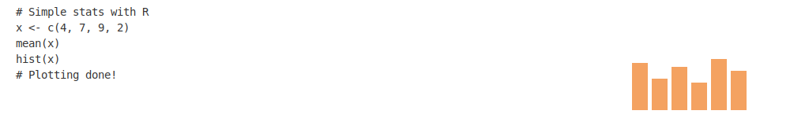

## Hi there, I'm Donada 👋
<!--
**donada-bichaku/donada-bichaku** is a ✨ _special_ ✨ repository because its `README.md` (this file) appears on your GitHub profile.

Here are some ideas to get you started:

- 🔭 I’m currently working on ...
- 🌱 I’m currently learning ...
- 👯 I’m looking to collaborate on ...
- 🤔 I’m looking for help with ...
- 💬 Ask me about ...
- 📫 How to reach me: ...
- 😄 Pronouns: ...
- ⚡ Fun fact: ...
-->

 

   
  

<!-- Custom coded banner with gradient and icons -->

- 👩‍🎓 I have majored in Computer Science.
- 💡 I am a former Software Business Analyst transitioning to Data Science.
- 🛠️ I’m currently working on predicting which passengers survived the Titanic shipwreck and learning on the go.
- 🌱 I’m currently learning Math for developers as part of my continuous Data Science journey.
- 📫 You can reach me at: [donada.bichaku@gmail.com](mailto:donada.bichaku@gmail.com) or on [LinkedIn](www.linkedin.com/in/donada-bichaku)
- ⚡ Fun fact: I’m about to learn how to lie with statistics — but I promise I won’t 😉

---

###  &nbsp; Languages and Tools I know:

 
 

---
#### 📊 GitHub Stats

  

